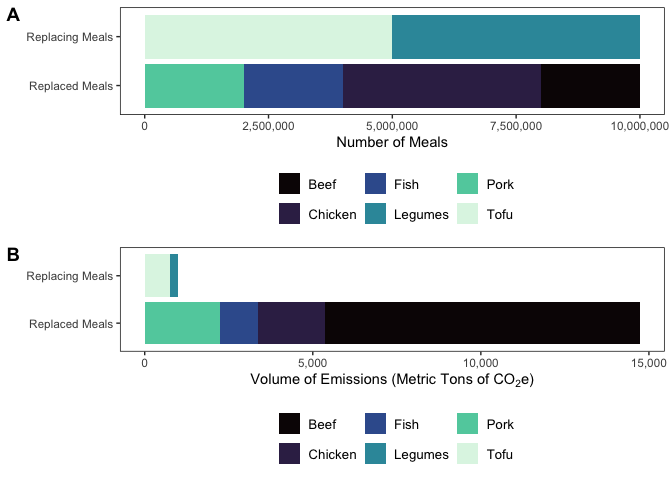
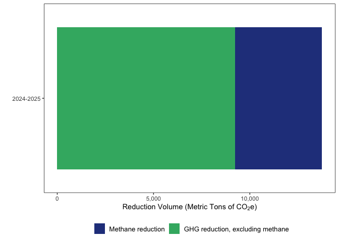

Data Cleaning and Analysis
================
2025-08-26

## package loading

``` r
library(tidyverse)
```

    ## ── Attaching core tidyverse packages ──────────────────────── tidyverse 2.0.0 ──
    ## ✔ dplyr     1.1.4     ✔ readr     2.1.5
    ## ✔ forcats   1.0.0     ✔ stringr   1.5.1
    ## ✔ ggplot2   3.5.1     ✔ tibble    3.2.1
    ## ✔ lubridate 1.9.3     ✔ tidyr     1.3.1
    ## ✔ purrr     1.0.2     
    ## ── Conflicts ────────────────────────────────────────── tidyverse_conflicts() ──
    ## ✖ dplyr::filter() masks stats::filter()
    ## ✖ dplyr::lag()    masks stats::lag()
    ## ℹ Use the conflicted package (<http://conflicted.r-lib.org/>) to force all conflicts to become errors

``` r
library(ggpubr)
library(viridis)
```

    ## Loading required package: viridisLite

## data loading

``` r
methane_figures <- read.csv("/Users/kenjinchang/github/methane-accounting/data/methane-figures.csv")
pilot_data <- read.csv("/Users/kenjinchang/github/methane-accounting/data/pilot-summary.csv")
```

## `methane_figures` cleaning

``` r
methane_figures
```

    ##                            food methane.from.flooded.rice enteric.methane
    ## 1                          Beer                         -               -
    ## 2                          Wine                         -               -
    ## 3                      Tomatoes                         -               -
    ## 4              Onions and Leeks                         -               -
    ## 5               Root Vegetables                         -               -
    ## 6  Cabbages and Other Brassicas                         -               -
    ## 7              Other Vegetables                         -               -
    ## 8                  Citrus Fruit                         -               -
    ## 9                       Bananas                         -               -
    ## 10                       Apples                         -               -
    ## 11           Berries and Grapes                         -               -
    ## 12                  Other Fruit                         -               -
    ## 13                      Avocado                         -               -
    ## 14                      Soymilk                         -               -
    ## 15                         Milk                         -     0.833587651
    ## 16                  Almond milk                         -               -
    ## 17                     Oat milk                         -               -
    ## 18                    Rice milk                0.29832153               -
    ## 19               Soybeans (Oil)                         -               -
    ## 20                   Palm (Oil)                         -               -
    ## 21              Sunflower (Oil)                         -               -
    ## 22               Rapeseed (Oil)                         -               -
    ## 23                 Olives (Oil)                         -               -
    ## 24               Beans & Pulses                         -               -
    ## 25                         Peas                         -               -
    ## 26                         Nuts                         -               -
    ## 27                   Groundnuts                         -               -
    ## 28                         Tofu                         -               -
    ## 29      Bovine Meat (Beef Herd)                         -     41.12140288
    ## 30     Bovine Meat (Dairy Herd)                         -     13.12901286
    ## 31                   Beef (avg)                         -     29.04801096
    ## 32           Mutton & Goat Meat                         -     20.11245975
    ## 33                     Pig Meat                         -     0.154919973
    ## 34                 Poultry Meat                         -     0.013397274
    ## 35                       Cheese                         -     7.118645187
    ## 36                         Eggs                         -     0.012962666
    ## 37                Fish (farmed)                         -               -
    ## 38         Crustaceans (farmed)                         -               -
    ## 39                        Bread                         -               -
    ## 40                   Maize Meal                         -               -
    ## 41                      Oatmeal                         -               -
    ## 42                         Rice               2.486012747               -
    ## 43                     Potatoes                         -               -
    ## 44      Cassava and Other Roots                         -               -
    ## 45                       Coffee                         -               -
    ## 46                          Tea                         -               -
    ## 47                    Chocolate                         -               -
    ## 48      Sugar (from sugar cane)                         -               -
    ## 49      Sugar (from sugar beet)                         -               -
    ## 50   Dark Chocolate (70% cocoa)                         -               -
    ## 51               Milk Chocolate                         -               -
    ## 52                        Pasta                         -               -
    ## 53                      Lentils                         -               -
    ##    manure.management ghg.emissions.with.selected.methane.factor
    ## 1                  -                                  1.1800000
    ## 2                  -                                  1.7900000
    ## 3                  -                                  2.0900000
    ## 4                  -                                  0.5000000
    ## 5                  -                                  0.4300000
    ## 6                  -                                  0.5100000
    ## 7                  -                                  0.5300000
    ## 8                  -                                  0.3900000
    ## 9                  -                                  0.8600000
    ## 10                 -                                  0.4300000
    ## 11                 -                                  1.5300000
    ## 12                 -                                  1.0500000
    ## 13                 -                                  2.4808780
    ## 14                 -                                  0.9800000
    ## 15       0.164719602                                  3.1500000
    ## 16                 -                                  0.7020774
    ## 17                 -                                  0.9031262
    ## 18                 -                                  1.1816592
    ## 19                 -                                  6.3200000
    ## 20                 -                                  7.3200000
    ## 21                 -                                  3.6000000
    ## 22                 -                                  3.7700000
    ## 23                 -                                  5.4200000
    ## 24                 -                                  1.7900000
    ## 25                 -                                  0.9800000
    ## 26                 -                                  0.4300000
    ## 27                 -                                  3.2300000
    ## 28                 -                                  3.1600000
    ## 29       1.693754745                                 99.4800000
    ## 30       0.837581536                                 33.3000000
    ## 31       1.328839041                                 70.5021064
    ## 32       0.493991841                                 39.7200000
    ## 33       0.571451936                                 12.3100000
    ## 34       0.061416599                                  9.8700000
    ## 35       1.363599071                                 23.8800000
    ## 36       0.079510018                                  4.6700000
    ## 37              4.07                                 13.6300000
    ## 38              4.16                                 26.8700000
    ## 39                 -                                  1.5700000
    ## 40                 -                                  1.7000000
    ## 41                 -                                  2.4800000
    ## 42                 -                                  4.4500000
    ## 43                 -                                  0.4600000
    ## 44                 -                                  1.3200000
    ## 45                 -                                 28.5300000
    ## 46                 -                                 21.0000000
    ## 47                 -                                 46.6500000
    ## 48                 -                                  3.2000000
    ## 49                 -                                  1.8100000
    ## 50                 -                                 33.8070000
    ## 51                 -                                 23.4239546
    ## 52                 -                                  1.6095411
    ## 53                 -                                  2.8190595

``` r
methane_figures <- methane_figures %>%
  mutate(methane.from.flooded.rice=as.numeric(methane.from.flooded.rice)) %>%
  mutate(enteric.methane=as.numeric(enteric.methane)) %>%
  mutate(manure.management=as.numeric(manure.management)) %>%
  replace(is.na(.),0) %>%
  mutate(total.methane=methane.from.flooded.rice+enteric.methane+manure.management) %>%
  mutate(percent.methane=total.methane/ghg.emissions.with.selected.methane.factor) %>%
  mutate(ghg.emissions.excluding.methane=ghg.emissions.with.selected.methane.factor-total.methane) %>%
  mutate(percent.not.methane=1-percent.methane)
```

    ## Warning: There was 1 warning in `mutate()`.
    ## ℹ In argument: `methane.from.flooded.rice =
    ##   as.numeric(methane.from.flooded.rice)`.
    ## Caused by warning:
    ## ! NAs introduced by coercion

    ## Warning: There was 1 warning in `mutate()`.
    ## ℹ In argument: `enteric.methane = as.numeric(enteric.methane)`.
    ## Caused by warning:
    ## ! NAs introduced by coercion

    ## Warning: There was 1 warning in `mutate()`.
    ## ℹ In argument: `manure.management = as.numeric(manure.management)`.
    ## Caused by warning:
    ## ! NAs introduced by coercion

``` r
methane_figures %>%
  arrange(desc(percent.methane)) %>%
  filter(food=="Beef (avg)"|food=="Pig Meat"|food=="Poultry Meat"|food=="Fish (farmed)"|food=="Tofu"|food=="Lentils") %>%
  head(10)
```

    ##            food methane.from.flooded.rice enteric.methane manure.management
    ## 1    Beef (avg)                         0     29.04801096         1.3288390
    ## 2 Fish (farmed)                         0      0.00000000         4.0700000
    ## 3      Pig Meat                         0      0.15491997         0.5714519
    ## 4  Poultry Meat                         0      0.01339727         0.0614166
    ## 5          Tofu                         0      0.00000000         0.0000000
    ## 6       Lentils                         0      0.00000000         0.0000000
    ##   ghg.emissions.with.selected.methane.factor total.methane percent.methane
    ## 1                                  70.502106   30.37685000     0.430864432
    ## 2                                  13.630000    4.07000000     0.298606016
    ## 3                                  12.310000    0.72637191     0.059006654
    ## 4                                   9.870000    0.07481387     0.007579926
    ## 5                                   3.160000    0.00000000     0.000000000
    ## 6                                   2.819059    0.00000000     0.000000000
    ##   ghg.emissions.excluding.methane percent.not.methane
    ## 1                       40.125256           0.5691356
    ## 2                        9.560000           0.7013940
    ## 3                       11.583628           0.9409933
    ## 4                        9.795186           0.9924201
    ## 5                        3.160000           1.0000000
    ## 6                        2.819059           1.0000000

``` r
absolute_methane_contribution <- methane_figures %>%
  select(food,total.methane,ghg.emissions.excluding.methane) %>%
  pivot_longer(!food,names_to="category",values_to="kgco2e") %>%
  filter(food=="Beef (avg)"|food=="Pig Meat"|food=="Poultry Meat"|food=="Fish (farmed)"|food=="Tofu"|food=="Lentils") %>%
  ggplot(aes(x=kgco2e,y=food,fill=category)) + 
  geom_col() + 
  scale_y_discrete(limits=c("Lentils","Tofu","Poultry Meat","Pig Meat","Fish (farmed)","Beef (avg)"),labels=c("Legumes","Tofu","Chicken","Pork","Fish","Beef")) +
  scale_fill_manual(values=c("royalblue4","mediumseagreen"),name="",labels=c("GHG emissions, excluding methane","GHG emissions from methane")) +
  xlab(bquote('Emissions Per Kilogram (kg CO'[2]*'e)')) +
  ylab("") +
  theme(legend.position="bottom",panel.grid=element_blank(),panel.background=element_rect(fill="white"),panel.border=element_rect(fill=NA),legend.title=element_text(size=10),legend.text=element_text(size=10),plot.title=element_text(size=10))
```

``` r
relative_methane_contribution <- methane_figures %>%
  select(food,percent.methane,percent.not.methane) %>%
  pivot_longer(!food,names_to="category",values_to="percent") %>%
  filter(food=="Beef (avg)"|food=="Pig Meat"|food=="Poultry Meat"|food=="Fish (farmed)"|food=="Tofu"|food=="Lentils") %>%
  ggplot(aes(x=percent,y=food,fill=category)) + 
  geom_col() +
   scale_y_discrete(limits=c("Lentils","Tofu","Poultry Meat","Pig Meat","Fish (farmed)","Beef (avg)"),labels=c("Legumes","Tofu","Chicken","Pork","Fish","Beef")) +
  scale_fill_manual(values=c("royalblue4","mediumseagreen"),name="",labels=c("Percent attributable to methane","Percent not attributable to methane")) +
  xlab("Percent (%)") +
  ylab("") + 
  theme(legend.position="bottom",panel.grid=element_blank(),panel.background=element_rect(fill="white"),panel.border=element_rect(fill=NA),legend.title=element_text(size=10),legend.text=element_text(size=10),plot.title=element_text(size=10))
```

``` r
methane_contribution_array <- ggarrange(absolute_methane_contribution,relative_methane_contribution,
         labels=c("A","B"))
ggsave(filename="methane.contribution.array.png",plot=methane_contribution_array,path="/Users/kenjinchang/github/methane-accounting/figures",width=40,height=12,units="cm",dpi=150,limitsize=TRUE)
methane_contribution_array
```

<!-- -->

## `pilot_data` cleaning

``` r
pilot_data #10 mil count derived from 131 sites added throughout 2024, 200 sites added through 2025, and the 850k annually via NYC H+H,
```

    ##     meals   count  category serving_weight total_weight emissions_factor
    ## 1 chicken 4000000  replaced              4     453592.0             4.40
    ## 2    beef 2000000  replaced              4     226796.0            41.35
    ## 3    pork 2000000  replaced              4     226796.0             9.83
    ## 4    fish 2000000  replaced              4     226796.0             4.98
    ## 5    tofu 5000000 replacing              3     425242.5             1.75
    ## 6 lentils 5000000 replacing              1     141747.5             1.68
    ##   ghg_emissions
    ## 1     1995804.8
    ## 2     9378014.6
    ## 3     2229404.7
    ## 4     1129444.1
    ## 5      744174.4
    ## 6      238135.8

``` r
protein_distribution_plot <- pilot_data %>%
  ggplot(aes(x=count,y=category,fill=meals)) + 
  geom_col() + 
  scale_fill_viridis_d(option="mako",labels=c("Beef","Chicken","Fish","Legumes","Pork","Tofu"),name="") +
  scale_y_discrete(limits=c("replaced","replacing"),labels=c("Replaced Meals","Replacing Meals")) +
  scale_x_continuous(labels=scales::comma) +
  xlab("Number of Meals") + 
  ylab("") + 
  theme(legend.position="bottom",panel.grid=element_blank(),panel.background=element_rect(fill="white"),panel.border=element_rect(fill=NA),legend.title=element_text(size=10),legend.text=element_text(size=10),plot.title=element_text(size=10))
```

``` r
protein_emissions_plot <- pilot_data %>%
  mutate(ghg_emissions=ghg_emissions/1000) %>%
  ggplot(aes(x=ghg_emissions,y=category,fill=meals)) + 
  geom_col() + 
  scale_fill_viridis_d(option="mako",labels=c("Beef","Chicken","Fish","Legumes","Pork","Tofu"),name="") +
  scale_y_discrete(limits=c("replaced","replacing"),labels=c("Replaced Meals","Replacing Meals")) +
  scale_x_continuous(labels=scales::comma) +
  xlab(bquote('Volume of Emissions (Metric Tons of CO'[2]*'e)')) +
  ylab("") + 
  theme(legend.position="bottom",panel.grid=element_blank(),panel.background=element_rect(fill="white"),panel.border=element_rect(fill=NA),legend.title=element_text(size=10),legend.text=element_text(size=10),plot.title=element_text(size=10))
```

``` r
emissions_array <- ggarrange(protein_distribution_plot,protein_emissions_plot,
          labels=c("A","B"),
          nrow=2)
ggsave(filename="overall.emissions.array.png",plot=emissions_array,path="/Users/kenjinchang/github/methane-accounting/figures",width=40,height=24,units="cm",dpi=150,limitsize=TRUE)
emissions_array
```

<!-- -->

``` r
pilot_data %>%
  group_by(category) %>%
  summarise(sum(ghg_emissions))
```

    ## # A tibble: 2 × 2
    ##   category  `sum(ghg_emissions)`
    ##   <chr>                    <dbl>
    ## 1 replaced             14732668.
    ## 2 replacing              982310.

``` r
prejoin_pilot_data <- pilot_data %>%
  mutate(meals=case_when(meals=="lentils"~"Legumes",
                         meals=="tofu"~"Tofu",
                         meals=="fish"~"Fish",
                         meals=="pork"~"Pork",
                         meals=="beef"~"Beef",
                         meals=="chicken"~"Chicken"))
prejoin_pilot_data
```

    ##     meals   count  category serving_weight total_weight emissions_factor
    ## 1 Chicken 4000000  replaced              4     453592.0             4.40
    ## 2    Beef 2000000  replaced              4     226796.0            41.35
    ## 3    Pork 2000000  replaced              4     226796.0             9.83
    ## 4    Fish 2000000  replaced              4     226796.0             4.98
    ## 5    Tofu 5000000 replacing              3     425242.5             1.75
    ## 6 Legumes 5000000 replacing              1     141747.5             1.68
    ##   ghg_emissions
    ## 1     1995804.8
    ## 2     9378014.6
    ## 3     2229404.7
    ## 4     1129444.1
    ## 5      744174.4
    ## 6      238135.8

``` r
prejoin_methane_figures <- methane_figures %>%
  filter(food=="Beef (avg)"|food=="Pig Meat"|food=="Poultry Meat"|food=="Fish (farmed)"|food=="Tofu"|food=="Beans & Pulses") %>%
  mutate(meals=case_when(food=="Beans & Pulses"~"Legumes",
                        food=="Tofu"~"Tofu",
                        food=="Beef (avg)"~"Beef",
                        food=="Pig Meat"~"Pork",
                        food=="Poultry Meat"~"Chicken",
                        food=="Fish (farmed)"~"Fish"))
prejoin_methane_figures
```

    ##             food methane.from.flooded.rice enteric.methane manure.management
    ## 1 Beans & Pulses                         0      0.00000000         0.0000000
    ## 2           Tofu                         0      0.00000000         0.0000000
    ## 3     Beef (avg)                         0     29.04801096         1.3288390
    ## 4       Pig Meat                         0      0.15491997         0.5714519
    ## 5   Poultry Meat                         0      0.01339727         0.0614166
    ## 6  Fish (farmed)                         0      0.00000000         4.0700000
    ##   ghg.emissions.with.selected.methane.factor total.methane percent.methane
    ## 1                                    1.79000    0.00000000     0.000000000
    ## 2                                    3.16000    0.00000000     0.000000000
    ## 3                                   70.50211   30.37685000     0.430864432
    ## 4                                   12.31000    0.72637191     0.059006654
    ## 5                                    9.87000    0.07481387     0.007579926
    ## 6                                   13.63000    4.07000000     0.298606016
    ##   ghg.emissions.excluding.methane percent.not.methane   meals
    ## 1                        1.790000           1.0000000 Legumes
    ## 2                        3.160000           1.0000000    Tofu
    ## 3                       40.125256           0.5691356    Beef
    ## 4                       11.583628           0.9409933    Pork
    ## 5                        9.795186           0.9924201 Chicken
    ## 6                        9.560000           0.7013940    Fish

``` r
joined_data <- left_join(prejoin_methane_figures,prejoin_pilot_data,by="meals") %>%
  select(meals,category,ghg_emissions,percent.methane,percent.not.methane) %>%
  mutate(methane_emissions=ghg_emissions*percent.methane) %>%
  mutate(nonmethane_emissions=ghg_emissions*percent.not.methane)
```

``` r
joined_data
```

    ##     meals  category ghg_emissions percent.methane percent.not.methane
    ## 1 Legumes replacing      238135.8     0.000000000           1.0000000
    ## 2    Tofu replacing      744174.4     0.000000000           1.0000000
    ## 3    Beef  replaced     9378014.6     0.430864432           0.5691356
    ## 4    Pork  replaced     2229404.7     0.059006654           0.9409933
    ## 5 Chicken  replaced     1995804.8     0.007579926           0.9924201
    ## 6    Fish  replaced     1129444.1     0.298606016           0.7013940
    ##   methane_emissions nonmethane_emissions
    ## 1              0.00             238135.8
    ## 2              0.00             744174.4
    ## 3        4040652.93            5337361.7
    ## 4         131549.71            2097855.0
    ## 5          15128.05            1980676.7
    ## 6         337258.80             792185.3

``` r
joined_data %>%
  group_by(category) %>%
  summarise(associated_nonmethane_costs=sum(nonmethane_emissions),associated_methane_costs=sum(methane_emissions),associated_emissions_costs=sum(ghg_emissions))
```

    ## # A tibble: 2 × 4
    ##   category  associated_nonmethan…¹ associated_methane_c…² associated_emissions…³
    ##   <chr>                      <dbl>                  <dbl>                  <dbl>
    ## 1 replaced               10208079.               4524589.              14732668.
    ## 2 replacing                982310.                     0                 982310.
    ## # ℹ abbreviated names: ¹​associated_nonmethane_costs, ²​associated_methane_costs,
    ## #   ³​associated_emissions_costs

``` r
year <- as.character(2024)
methane_reduction <- 4524589
emissions_reduction <- 14732668.2-982310.2
nonmmethane_reduction <- 10208078.7-982310.2
impact_data <- tibble(year,emissions_reduction,nonmmethane_reduction,methane_reduction)
impact_data
```

    ## # A tibble: 1 × 4
    ##   year  emissions_reduction nonmmethane_reduction methane_reduction
    ##   <chr>               <dbl>                 <dbl>             <dbl>
    ## 1 2024             13750358              9225768.           4524589

``` r
annual_impact_plot <- impact_data %>%
  select(year,nonmmethane_reduction,methane_reduction) %>%
  pivot_longer(!year,values_to="value",names_to="reduction") %>%
  mutate(value=value/1000) %>%
  ggplot(aes(x=value,y=year,fill=reduction)) + 
  geom_col() + 
  scale_fill_manual(values=c("royalblue4","mediumseagreen"),name="",labels=c("Methane reduction","GHG reduction, excluding methane")) +
  scale_x_continuous(labels=scales::comma) +
  scale_y_discrete(labels="2024-2025") +
  ylab("") + 
  xlab(bquote('Reduction Volume (Metric Tons of CO'[2]*'e)')) +
  theme(legend.position="bottom",panel.grid=element_blank(),panel.background=element_rect(fill="white"),panel.border=element_rect(fill=NA),legend.title=element_text(size=10),legend.text=element_text(size=10),plot.title=element_text(size=10))
ggsave(filename="annual.impact.png",plot=annual_impact_plot,path="/Users/kenjinchang/github/methane-accounting/figures",width=40,height=12,units="cm",dpi=150,limitsize=TRUE)
annual_impact_plot
```

<!-- -->
